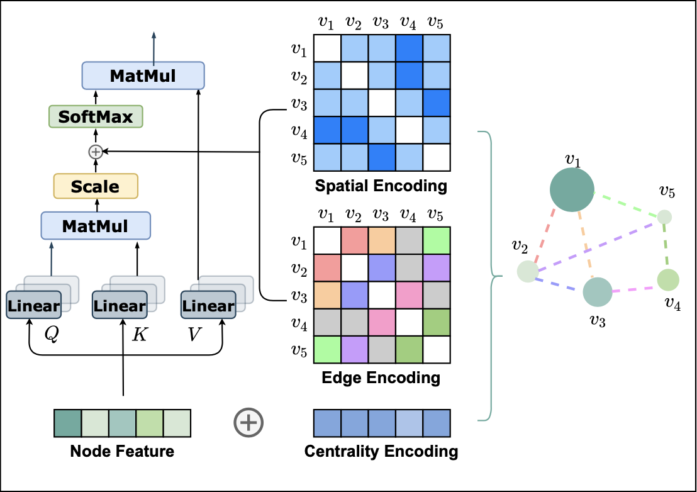

# Do Transformers Really Perform Bad for Graph Representation?

## Structural Encoding

### Centrality Encoding

In a naive port of GNNs from transformers, the attention distribution would be computed based on the semantic correlation between nodes. However, [it’s been proven](https://journals.sagepub.com/doi/10.1177/1354856510394539) that another prospective extremely descriptive feature in GNNs is *node centrality* - using global degree centrality to inform prediction on individual nodes. Where the two $deg(v_i)$ represent the indegree and outdegree,

$$
h_i^{(0)}=x_i+z^-_{deg^-(v_i)}+z^+_{deg^+(v_i)}
$$

This expression is simplified to $x_i+z_{deg(v+i)}$ if the graph is undirected.

### Spatial Encoding

One of the various beneficial properties of a transformer is its ability to reference context from any position in the sequence - something that was fully exploited in the overtaking of the RNN paradigm. Unfortunately, this requires transformers to explicitly specify positions via positional encodings. The problem arises immediately that graphs are not arranged as a sequence, and are instead represented as multi-dimensional spatial data linked by edges.

The spatial encoding used is a function $\phi(v_i,v_j):V\times{V}\rightarrow \mathbb{R}$ which serves as a connectivity metric between two nodes $v_i$ and $v_j$ in a graph $G$
. In the specific implementation demonstrated in the paper, the distance of the shortest path (SPD) is used. If two nodes are disconnected, the output of the function is a special value such as -1. Each feasible output is given a learnable scalar which serves as the bias term in the self-attention module. 

Where $A_{ij}$ is the $(i,j)$-element of the Query-Key product matrix $A$,

$$
A_{ij}=\frac{(h_iW_Q)(h_jW_K)^T}{\sqrt{d}}+b_{\phi(v_i,v_j)}
$$

This model is superior than conventional CNNs for two reasons. Firstly, it’s grabbing information from the entire graph as opposed to just immediate neighbours. Secondly, each node can adapt to the global learned representation according to structural information. For example, if $b_{\phi(v_i, v_j)}$ is learned to be a decreasing function w.r.t $\phi(v_i, v_j)$, the model will pay more attention to the nodes near it and pay less attention to the ones far away from it.

### Edge Encoding in the Attention

Edges may also have features describing the relationship between multiple nodes. To facilitate this leveraging global structural context, a new method is developed in the paper taking inspiration from multi-hop graph neural network methods. For each ordered node pair $(v_i, v_j)$, we take the shortest path $\text{SP}_{ij}=(e_1,e_2,...,e_N)$ from $v_i$ to $v_j$, and compute an average of the dot-products of the edge feature and a learnable embedding along the path. This edge encoding will serve as a bias term in the attention module. Where $x_{e_{n}}$ is the feature of the $n$-th edge $e_n$ in $\text{SP}_{ij}$, $w^E_n\in\mathbb{R}^{d_E}$ is the $n$-th weight embedding, and $d_E$ is the dimensionality of the edge feature,

$$
A_{ij}=\frac{(h_iW_Q)(h_jW_K)^T}{\sqrt{2}}+b_{\phi(v_i, v_j)}+c_{ij}
$$

$$
c_{ij}=\frac{1}{N}\sum^N_{n=1} x_{e_{n}}(w^E_n)^T
$$

## Implementation details

### Graphormer Layer

$$
h'^{(l)}= \text{MHA}(\text{LN}(h^{(l-1)}))+h^{(l-1)}
$$

$$
h^{(l)}=\text{FFN}(\text{LN}(h'^{(l)}))+h'^{(l)}
$$

### Special Node

A special node `[VNode]` is included, which has a direct connection to every other node. After being updated in the AGGREGATE-COMBINE step, it serves as the representation of the entire graph $h_G$ in the final layer.